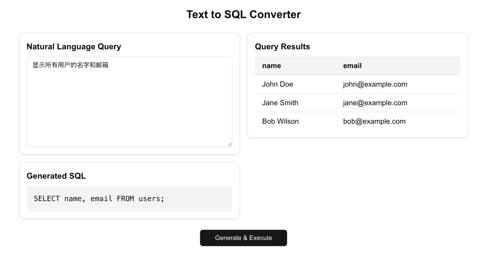

# Text to SQL Converter

A modern web application that converts natural language queries into SQL statements using AI. Built with Next.js, OpenAI, and SQLite.



## Features

- 🤖 Natural language to SQL conversion using GPT-3.5
- 💾 Local SQLite database for testing queries
- ⚡ Real-time query execution
- 🎨 Modern UI with Shadcn components
- 🌐 Easy deployment to Vercel

## Getting Started

### Prerequisites

- Node.js 18+
- npm or yarn
- OpenAI API key

### Installation

1. Clone the repository:

```bash
git clone https://github.com/sfyr111/text-to-sql-app.git
cd text-to-sql-app
```

2. Install dependencies:

```bash
npm install
```

3. Create a `.env.local` file in the root directory:

```env
OPENAI_API_KEY=your-api-key-here
OPENAI_API_BASE_URL=https://api.vveai.com/v1
```

4. Start the development server:

```bash
npm run dev
```

5. Open [http://localhost:3000](http://localhost:3000) in your browser.

## Usage

1. Enter your query in natural language (e.g., "Show me all users who made orders above $100")
2. Click "Generate & Execute"
3. View the generated SQL query and its results

## Database Schema

The application includes a sample SQLite database with the following tables:

### Users

```sql
CREATE TABLE users (
  id INTEGER PRIMARY KEY AUTOINCREMENT,
  name TEXT NOT NULL,
  email TEXT UNIQUE NOT NULL,
  created_at TIMESTAMP DEFAULT CURRENT_TIMESTAMP
);
```

### Orders

```sql
CREATE TABLE orders (
  id INTEGER PRIMARY KEY AUTOINCREMENT,
  user_id INTEGER,
  amount DECIMAL(10,2),
  created_at TIMESTAMP DEFAULT CURRENT_TIMESTAMP,
  FOREIGN KEY (user_id) REFERENCES users(id)
);
```

## Deployment

This application can be easily deployed to Vercel:

1. Push your code to GitHub
2. Import the project in Vercel
3. Add your environment variables
4. Deploy!

## Tech Stack

- [Next.js](https://nextjs.org/) - React framework
- [OpenAI API](https://openai.com/) - AI language model
- [SQLite](https://www.sqlite.org/) - Database
- [Shadcn/ui](https://ui.shadcn.com/) - UI components
- [Tailwind CSS](https://tailwindcss.com/) - Styling

## License

This project is licensed under the MIT License - see the [LICENSE](LICENSE) file for details.
